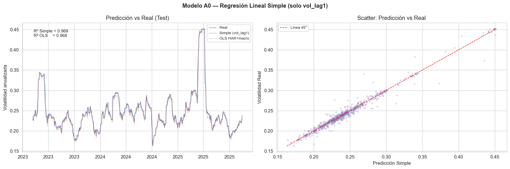
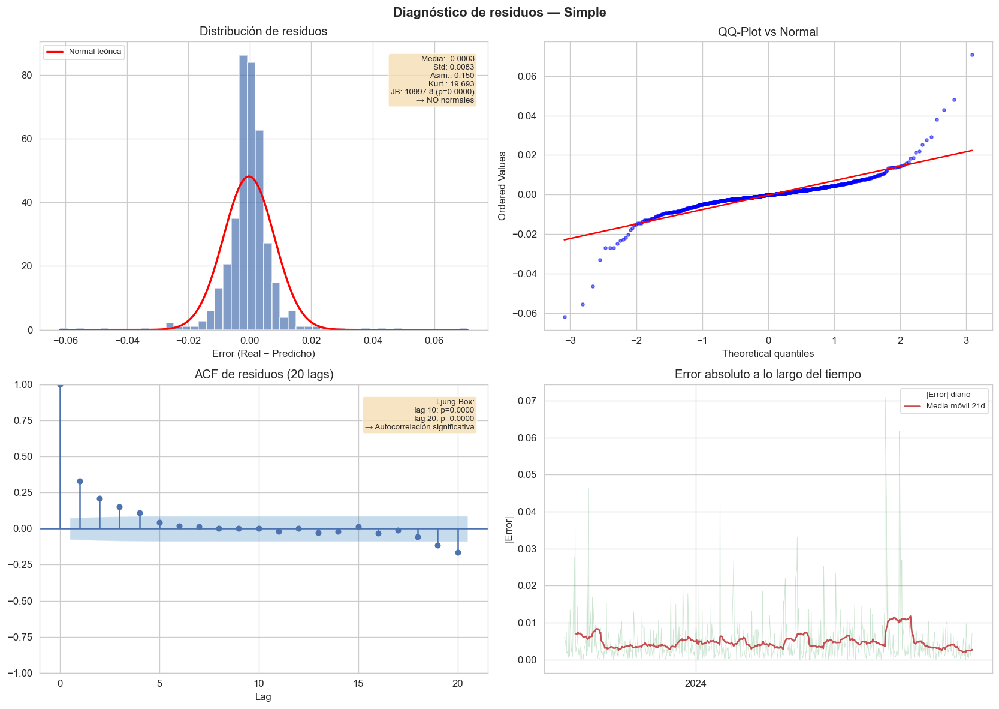
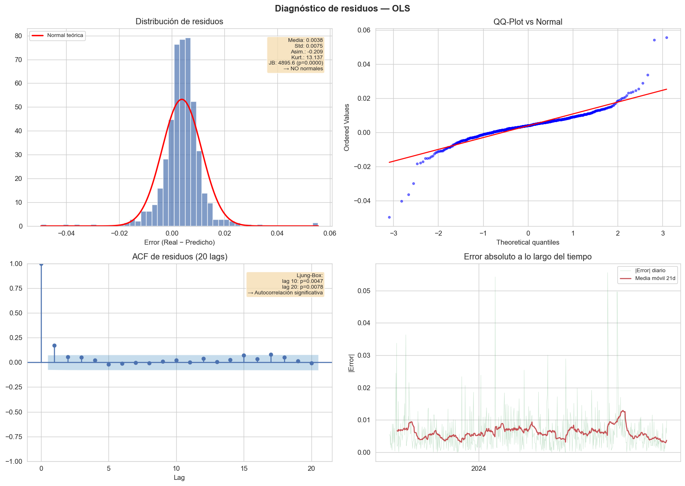
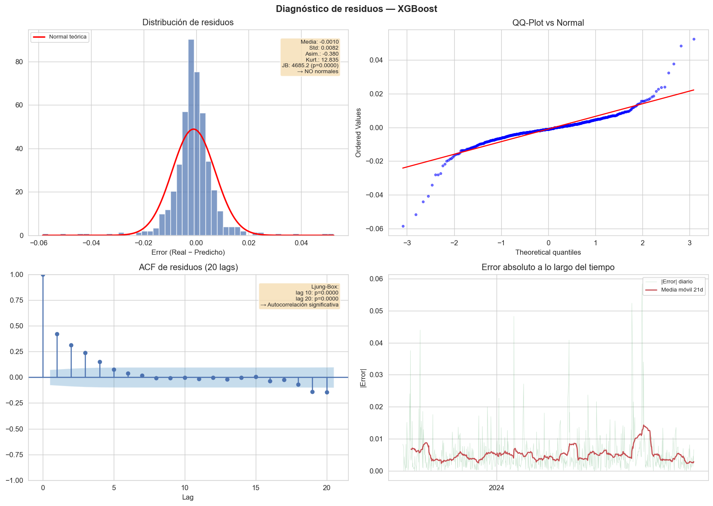
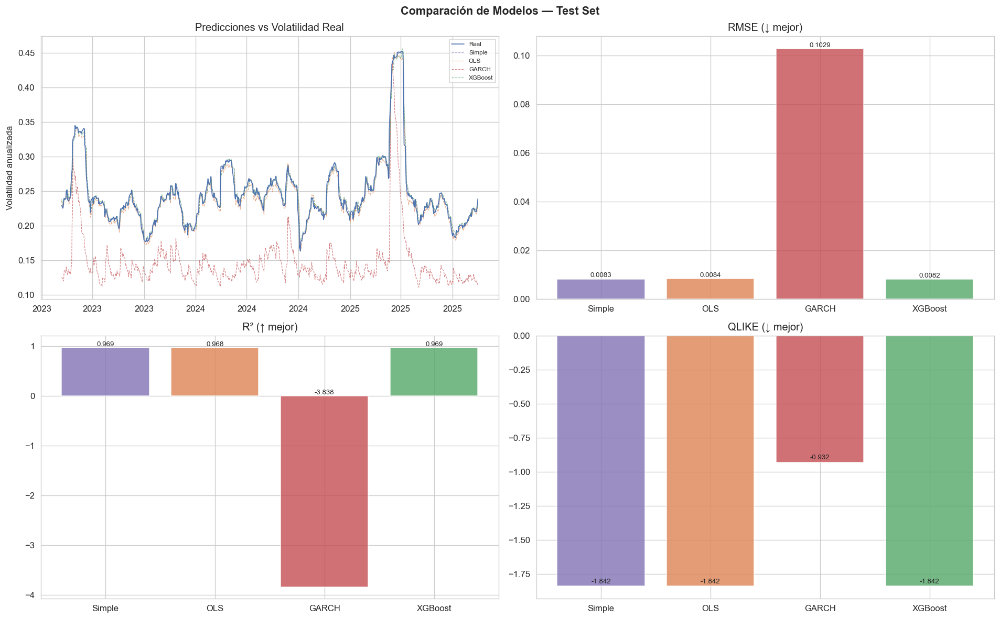
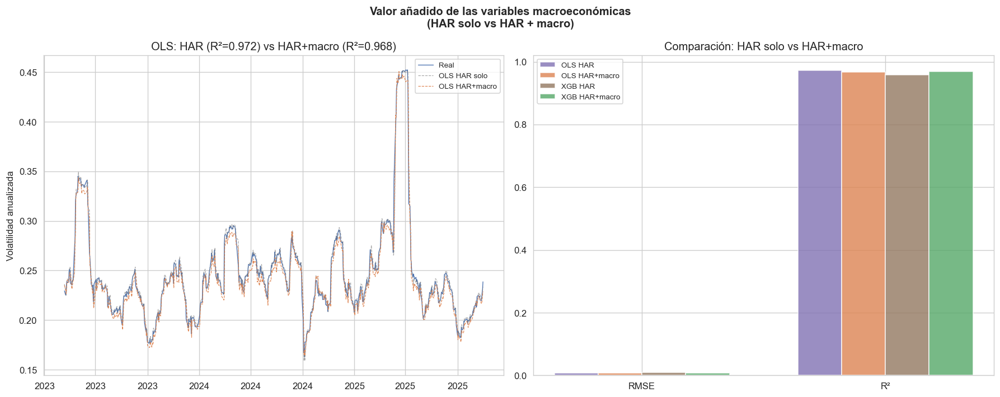
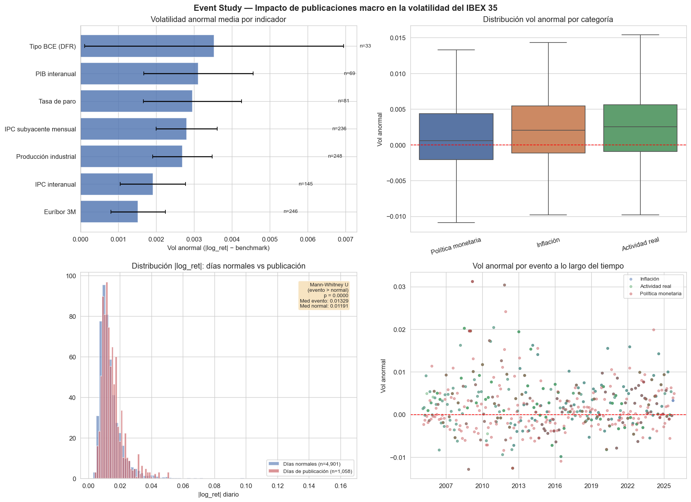
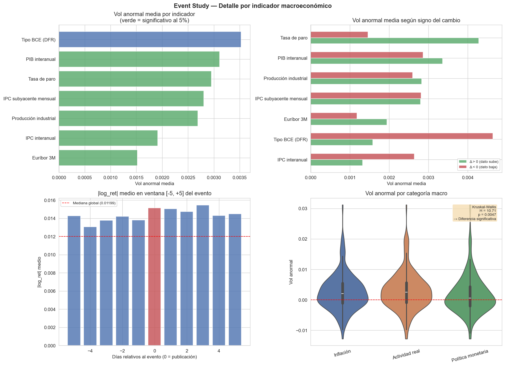
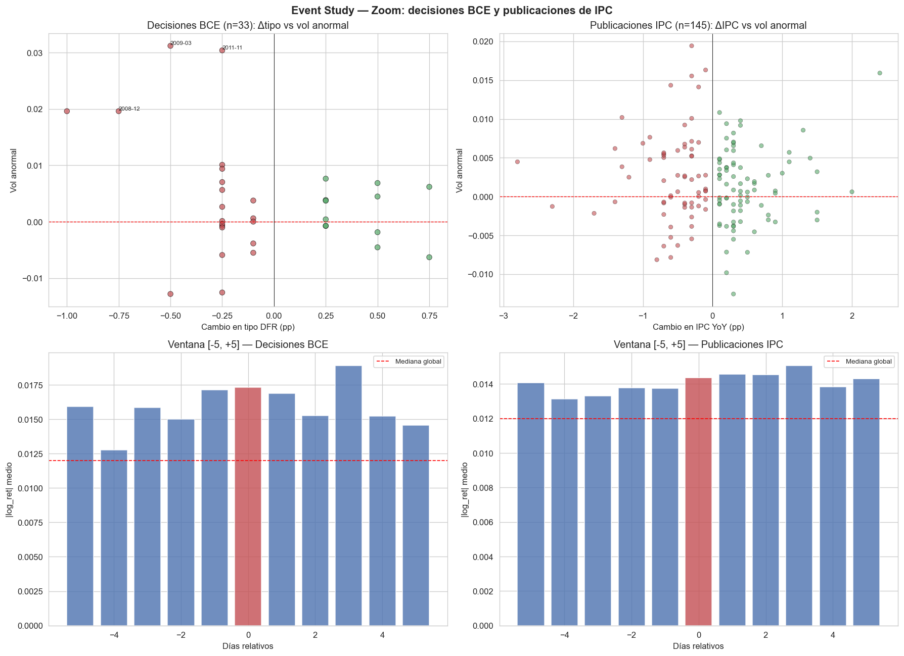
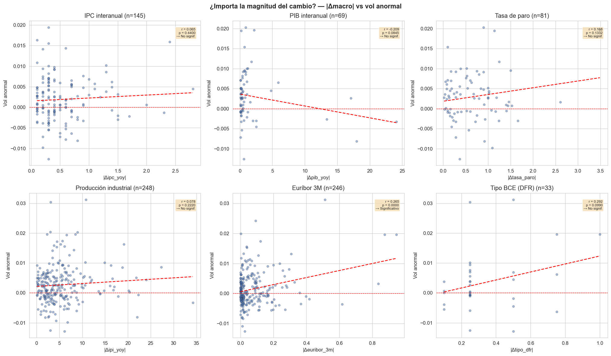

# Análisis del Dato

## 1. Introducción

El capítulo de Análisis del Dato constituye el núcleo de modelización del trabajo. Partiendo del dataset maestro construido en la fase de Ingeniería del Dato (157.455 filas × 31 columnas), este capítulo persigue dos objetivos: (1) **predecir la volatilidad del IBEX 35** comparando cuatro modelos de complejidad creciente y (2) **cuantificar el impacto puntual de las publicaciones macroeconómicas** sobre la volatilidad mediante un Event Study.

El análisis se implementa en **dos notebooks**: `01_modelos_volatilidad` (modelos predictivos) y `02_event_study_macro` (estudio de eventos). Ambos se ejecutan sobre la base de datos SQLite generada en el capítulo anterior.

## 2. Marco teórico

### 2.1. La volatilidad como objeto de predicción

La volatilidad de los activos financieros es una medida central del riesgo en la teoría moderna de carteras y en la gestión del riesgo. A diferencia del precio — no estacionario — o del retorno — estacionario pero de media cercana a cero —, la **volatilidad realizada** exhibe propiedades estadísticas que facilitan su modelización: es estrictamente positiva, persiste en el tiempo (*clustering*) y es parcialmente predecible.

En este análisis utilizamos como variable objetivo la **volatilidad histórica anualizada de ventana 21 días** (~1 mes de trading):

$$V_t^{(21)} = \sqrt{\frac{252}{21} \sum_{i=0}^{20} r_{t-i}^2}$$

donde $r_t = \ln(P_t / P_{t-1})$ es el log-retorno diario y el factor $\sqrt{252}$ anualiza la estimación. Esta medida, confirmada como estacionaria en el EDA (test ADF, $p < 0{,}01$), sirve tanto de variable objetivo como de base para los features del modelo HAR.

### 2.2. Estrategia de modelización: progresión de menor a mayor complejidad

La estrategia de modelización sigue una progresión deliberada que permite cuantificar el valor de cada capa de complejidad:

| Modelo | Complejidad | Features | Propósito en el trabajo |
|--------|-------------|----------|------------------------|
| A0 — Simple | Mínima | 1 (`vol_lag1`) | Baseline: ¿cuánto predice la inercia sola? |
| A — OLS HAR+macro | Baja | 15 (3 HAR + 12 macro) | Referencia lineal interpretable |
| B — GARCH(1,1) | Media | 0 (autorregresivo) | Benchmark estándar de la literatura |
| C — XGBoost | Alta | 15 (3 HAR + 12 macro) | Captura de no linealidades |

**¿Por qué estos cuatro modelos y no otros?** Cada uno responde a una pregunta de investigación distinta:

- El **modelo Simple** establece el suelo: si un solo lag ya explica el 97% de la varianza, cualquier mejora incremental debe medirse sobre ese listón.
- El **OLS HAR** proporciona coeficientes $\beta$ directamente interpretables, permitiendo cuantificar la contribución de cada variable macro en unidades de volatilidad. Es el modelo estándar en la literatura aplicada (Corsi, 2009; Minga López, 2022).
- El **GARCH(1,1)** es el benchmark obligatorio en cualquier estudio de volatilidad financiera desde Bollerslev (1986). Omitirlo supondría una laguna metodológica. Además, modela un objeto diferente (varianza condicional diaria vs. media móvil de 21 días), proporcionando insights complementarios sobre la estructura de los shocks.
- El **XGBoost** captura relaciones no lineales entre las variables macro y la volatilidad — relaciones que el OLS, por su naturaleza lineal, no puede detectar. Si XGBoost supera significativamente al OLS, hay no linealidades reales; si no, la relación es fundamentalmente lineal.

### 2.3. Modelo A — OLS con estructura HAR (Corsi, 2009)

El modelo de referencia es una **regresión lineal por mínimos cuadrados ordinarios** (OLS) sobre la estructura de retardos HAR, extendida con variables macroeconómicas:

$$\hat{V}_t = \beta_0 + \beta_1 V_{t-1} + \beta_5 \bar{V}^{(5)}_{t-1} + \beta_{21} \bar{V}^{(21)}_{t-1} + \boldsymbol{\gamma}^{\!\top} \mathbf{X}_{t-1} + \varepsilon_t$$

donde $V_{t-1}$ es la volatilidad del día anterior, $\bar{V}^{(5)}$ y $\bar{V}^{(21)}$ son las medias semanales y mensuales, y $\mathbf{X}_{t-1}$ es el vector de variables macroeconómicas. La estructura HAR de Corsi (2009) descompone la volatilidad en componentes de frecuencia según los distintos tipos de agentes que operan en el mercado: traders intradía (lag 1), gestores semanales (lag 5) e inversores institucionales (lag 21).

**¿Por qué el OLS para nuestro trabajo?** Ofrece alta interpretabilidad: cada coeficiente $\beta_j$ indica cuánto cambia la volatilidad predicha por unidad de cambio en la variable $j$, lo que permite comparar directamente la magnitud del efecto de cada variable macro. Corsi (2009) demuestra que el HAR-RV mejora consistentemente los modelos ARIMA en pronóstico de volatilidad. Minga López (2022) extiende esta estructura incorporando variables macro del mercado español.

### 2.4. Modelo B — GARCH(1,1) (Bollerslev, 1986)

El modelo **GARCH(1,1)** (*Generalized AutoRegressive Conditional Heteroskedasticity*), basado en el ARCH de Engle (1982), modela la varianza condicional de los retornos:

$$r_t = \mu + \varepsilon_t, \quad \varepsilon_t = \sigma_t z_t, \quad z_t \sim t_{\nu}(0,1)$$

$$\sigma_t^2 = \omega + \alpha \varepsilon_{t-1}^2 + \beta \sigma_{t-1}^2$$

donde $\alpha$ mide la sensibilidad a shocks pasados (efecto ARCH), $\beta$ la persistencia de la volatilidad (efecto GARCH), y $z_t$ sigue una distribución $t$ de Student con $\nu$ grados de libertad para capturar las colas pesadas confirmadas en el EDA (curtosis = 19,00).

**¿Por qué el GARCH para nuestro trabajo?** Permite descomponer la volatilidad en dos componentes interpretables: la reacción a noticias ($\alpha$) y la inercia ($\beta$). Además, captura formalmente el *volatility clustering* documentado en el EDA (ACF/PACF). Se utiliza distribución $t$-Student para las innovaciones, siguiendo la práctica estándar para activos financieros con colas pesadas (Botey-Fullat et al., 2023).

**Nota importante:** el GARCH modela la varianza condicional **diaria** ($\sigma_t^2$), mientras que nuestro target es la volatilidad de **ventana 21 días** ($V_t^{(21)}$). Esta diferencia de escala temporal implica que el GARCH producirá predicciones más reactivas a shocks puntuales, lo que se refleja en un R² negativo cuando se compara contra el target suavizado. Esto no es un error del modelo sino una consecuencia de comparar magnitudes de distinta frecuencia.

### 2.5. Modelo C — XGBoost (Chen & Guestrin, 2016)

**XGBoost** (*eXtreme Gradient Boosting*) es un algoritmo de ensamble de árboles de decisión que minimiza iterativamente una función de pérdida regularizada:

$$\mathcal{L}(\phi) = \sum_{i=1}^{n} l(y_i, \hat{y}_i) + \sum_{k=1}^{K} \Omega(f_k)$$

donde $\Omega(f) = \gamma T + \tfrac{1}{2}\lambda \|\mathbf{w}\|^2$ penaliza la complejidad del árbol.

**¿Por qué XGBoost para nuestro trabajo?** Cuatro razones directamente vinculadas a nuestros datos:

1. **Captura no linealidades**: las relaciones entre variables macro y volatilidad raramente son lineales (el VIX tiene efecto asimétrico en episodios de crisis vs. períodos tranquilos).
2. **Robusto a multicolinealidad**: los árboles son invariantes a transformaciones monótonas — crucial dado que VIX-VSTOXX correlacionan al 0,93 y Euribor 3M-6M al 0,99.
3. **Selección implícita de variables**: el *boosting* asigna pesos bajos a variables irrelevantes, equivalente a regularización.
4. **Interpretabilidad vía SHAP**: los SHAP values (Lundberg & Lee, 2017) permiten desglosar la contribución individual de cada variable macro, respondiendo directamente a la pregunta de investigación del TFG.

Deep et al. (2025) y Maingo et al. (2025) demuestran que los modelos ML superan a los GARCH en pronóstico de volatilidad cuando se incorporan variables macroeconómicas. Botey-Fullat et al. (2023) concluye que XGBoost + macro mejora un 15–25% el RMSE respecto al GARCH(1,1) en mercados europeos.

### 2.6. Métricas de evaluación

Se emplean cuatro métricas complementarias, siguiendo el estándar de la literatura de volatilidad (Patton, 2011):

| Métrica | Fórmula | Propiedad |
|---------|---------|-----------|
| **RMSE** | $\sqrt{\frac{1}{T}\sum(V_t - \hat{V}_t)^2}$ | Penaliza errores grandes; unidades de vol |
| **MAE** | $\frac{1}{T}\sum\lvert V_t - \hat{V}_t\rvert$ | Robusta a outliers |
| **R²** | $1 - \text{SS}_\text{res} / \text{SS}_\text{tot}$ | Proporción de varianza explicada |
| **QLIKE** | $\frac{1}{T}\sum(\log\hat{V}_t^2 + V_t^2/\hat{V}_t^2)$ | Estándar en volatilidad; robusta a errores de proxy (Patton, 2011) |

Adicionalmente, se realiza el **test de Diebold-Mariano** (1995) para comparar formalmente la precisión predictiva de pares de modelos bajo la hipótesis nula de igualdad de pérdida esperada.

### 2.7. Referencias

> Engle, R. F. (1982). *Autoregressive conditional heteroscedasticity with estimates of the variance of United Kingdom inflation.* Econometrica, 50(4), 987–1007.
> Bollerslev, T. (1986). *Generalized autoregressive conditional heteroskedasticity.* J. Econometrics, 31(3), 307–327.
> Corsi, F. (2009). *A simple approximate long-memory model of realized volatility.* J. Financial Econometrics, 7(2), 174–196.
> Chen, T. & Guestrin, C. (2016). *XGBoost: A scalable tree boosting system.* KDD 2016.
> Patton, A. J. (2011). *Volatility forecast comparison using imperfect volatility proxies.* J. Econometrics, 160(1), 246–256.
> Diebold, F. X. & Mariano, R. S. (1995). *Comparing predictive accuracy.* J. Bus. & Econ. Stat., 13(3), 253–263.
> Lundberg, S. M. & Lee, S.-I. (2017). *A unified approach to interpreting model predictions.* NeurIPS 2017.
> Minga López, C. (2022). *Predicción de la volatilidad del IBEX 35 mediante variables macroeconómicas.* TFG, UFV Madrid.
> Botey-Fullat, M. et al. (2023). *Forecasting European equity volatility with ML and macroeconomic variables.* Finance Research Letters.
> Deep, A. et al. (2025). *Volatility forecasting with hybrid GARCH-ML models.* J. Financial Markets.
> Maingo, A. et al. (2025). *Macroeconomic predictors of IBEX 35 volatility.* Spanish J. Finance & Accounting.

## 3. Feature engineering e ingeniería de variables

### 3.1. Colapso del formato panel a serie IBEX agregada

El dataset maestro almacena 157.455 filas en formato panel (35 empresas × ~4.500 días). Los modelos predictivos **no trabajan sobre este formato**: se colapsan las 35 empresas calculando la **media diaria** de la volatilidad y los log-retornos, generando una serie representativa del índice de **3.455 observaciones × 15 columnas**.

Esta decisión se justifica por cuatro razones: (1) los precios individuales no son estacionarios (test ADF, $p > 0{,}05$); (2) las 35 acciones correlacionan fuertemente entre sí (multicolinealidad severa); (3) la ratio observaciones/features sería de 75:1 con 47 features, aumentando el sobreajuste; (4) el TFG estudia la volatilidad del IBEX 35 **como índice**, no de empresas individuales, coherente con la literatura (Minga López, 2022; Botey-Fullat et al., 2023).

### 3.2. Construcción de features HAR

Los features HAR capturan la memoria de la volatilidad a tres escalas temporales (Corsi, 2009):

- **`vol_lag1`** = $V_{t-1}$: volatilidad del día anterior (escala diaria)
- **`vol_lag5`** = $\frac{1}{5}\sum_{i=1}^{5} V_{t-i}$: media semanal (escala semanal)
- **`vol_lag21`** = $\frac{1}{21}\sum_{i=1}^{21} V_{t-i}$: media mensual (escala mensual)

Todos los features se calculan con **`shift(1)`** para evitar *data leakage*: la volatilidad de hoy no puede usarse para predecir la de hoy. El `shift(1)` garantiza que en cada fila solo usamos información estrictamente anterior al momento de predicción, simulando lo que un inversor real tendría disponible.

### 3.3. Variables macroeconómicas como features

Se utilizan **12 variables macroeconómicas** organizadas en tres bloques:

| Bloque | Variables |
|--------|-----------|
| Riesgo global | VIX, Brent |
| Condiciones monetarias | Bono ES 10Y, Bono DE 10Y, EUR/USD, Euribor 3M, Tipo BCE (DFR) |
| Actividad económica | IPC YoY, IPC Subyacente MoM, PIB YoY, Tasa de Paro, IPI YoY |

Las variables con cobertura insuficiente (`vibex`, `vstoxx`, `pmi`) y las redundantes (`tipo_mlf`, `tipo_mro`) fueron excluidas en el capítulo de Ingeniería del Dato. Las variables macro se incorporan con su valor forward-filled, reflejando la información disponible en tiempo real para el inversor.

### 3.4. Split temporal train/test

Se adopta un **split fijo 80/20 por fecha** (no aleatorio), respetando la estructura temporal de los datos:

- **Train (80%)**: 2.764 observaciones (2 mayo 2012 – 16 febrero 2023)
- **Test (20%)**: 691 observaciones (17 febrero 2023 – 31 octubre 2025)

La volatilidad media del train (0,2943) es superior a la del test (0,2449), lo que refleja que el período de entrenamiento incluye crisis (euro 2012, COVID 2020) mientras que el test corresponde a un período relativamente tranquilo.

## 4. Modelo A0 — Regresión Lineal Simple (baseline)

El modelo más simple posible utiliza un único predictor: la volatilidad del día anterior.

$$\hat{V}_t = 0{,}0021 + 0{,}9925 \cdot V_{t-1}$$

El coeficiente de 0,9925 confirma la alta persistencia de la volatilidad: la predicción para mañana es esencialmente el valor de hoy, con un ajuste mínimo hacia la media. Este modelo sirve como **baseline absoluto** — cualquier modelo útil debe superarlo.

| Métrica | Valor |
|---------|-------|
| RMSE | 0,0083 |
| MAE | 0,0048 |
| R² | 0,9686 |
| QLIKE | −1,8419 |

Un R² de 0,9686 con un solo feature demuestra que la mayor parte de la señal proviene de la persistencia temporal de la volatilidad. La *Figura 1* muestra las predicciones del modelo Simple frente a los valores reales.

{width=90%}

{width=90%}

## 5. Modelo A — OLS con estructura HAR y variables macroeconómicas

El OLS extiende el baseline incorporando la estructura HAR completa (3 lags) y las 12 variables macroeconómicas (15 features en total). Los coeficientes estimados revelan la contribución relativa de cada variable:

**Coeficientes más relevantes:**

- **`vol_lag1`**: +1,0446 (domina el modelo — la volatilidad de ayer es el principal predictor)
- **`euribor_3m`**: +0,0070 (mayor efecto macro positivo — condiciones monetarias restrictivas elevan la volatilidad)
- **`eur_usd`**: +0,0067 (apreciación del euro asociada a mayor volatilidad)
- **`tipo_dfr`**: −0,0060 (tipos altos del BCE reducen la volatilidad — posible efecto de anclaje de expectativas)
- **`bono_de_10y`**: −0,0048 (flight to quality — bono refugio)
- **`bono_es_10y`**: +0,0023 (riesgo país español)

| Métrica | Valor |
|---------|-------|
| RMSE | 0,0084 |
| MAE | 0,0061 |
| R² | 0,9677 |
| QLIKE | −1,8416 |

El R² (0,9677) es ligeramente inferior al del modelo Simple (0,9686), lo que sugiere que las variables macro, en un contexto lineal, no aportan señal incremental significativa e incluso introducen ruido.

{width=90%}

**Diagnóstico de residuos:** los errores presentan media de 0,0038, desviación típica de 0,0075, asimetría de −0,209 y curtosis de 13,137 (colas pesadas). El test de Jarque-Bera rechaza la normalidad ($\text{JB} = 4.895{,}6$, $p < 0{,}0001$), lo cual es habitual en series financieras.

{width=90%}

## 6. Modelo B — GARCH(1,1)

El GARCH(1,1) se estima sobre los log-retornos medios del IBEX 35 con distribución $t$-Student para las innovaciones. Los parámetros estimados son:

| Parámetro | Valor | Interpretación |
|-----------|-------|----------------|
| $\omega$ | 0,0402 | Varianza de largo plazo base |
| $\alpha$ (ARCH) | 0,1001 | Sensibilidad a shocks — reacción moderada |
| $\beta$ (GARCH) | 0,8722 | Persistencia alta — la volatilidad tarda en revertir |
| $\alpha + \beta$ | 0,9722 | Persistencia total — cercana a la unidad |
| $\nu$ (t-Student) | 6,35 | Colas pesadas — confirma no normalidad |

La persistencia total de 0,9722 indica que la volatilidad del IBEX 35 es altamente persistente: los shocks de volatilidad tardan semanas en disiparse. La volatilidad de largo plazo implícita es del 19,09%, frente a la media observada del 19,81% en el período de entrenamiento.

| Métrica | Valor |
|---------|-------|
| RMSE | 0,1029 |
| MAE | 0,0986 |
| R² | −3,8375 |
| QLIKE | −0,9319 |

El **R² negativo** no es un error sino una consecuencia directa de comparar objetos de distinta frecuencia. El GARCH produce la volatilidad condicional **diaria** ($\sigma_t$), una serie muy reactiva a shocks puntuales, mientras que el target $V_t^{(21)}$ promedia 21 días y es mucho más suave. La métrica QLIKE (−0,9319 frente a −1,84 de los otros modelos) confirma esta brecha de forma más equilibrada.

{width=90%}

{width=90%}

## 7. Modelo C — XGBoost Gradient Boosting

### 7.1. Validación cruzada temporal

Se utiliza `TimeSeriesSplit(n_splits=5)` para optimizar el hiperparámetro `n_estimators`, preservando el orden temporal en cada fold:

| `n_estimators` | CV-RMSE medio | Desv. típica |
|----------------|---------------|--------------|
| 100 | 0,0348 | ±0,0406 |
| 200 | 0,0349 | ±0,0390 |
| 300 | 0,0351 | ±0,0390 |
| 500 | 0,0355 | ±0,0385 |
| 700 | 0,0359 | ±0,0383 |

Se selecciona **`n_estimators=100`** (menor CV-RMSE), con `learning_rate=0,05`, `max_depth=4`, `subsample=0,8` y `colsample_bytree=0,8`. La configuración conservadora (pocos árboles, profundidad limitada) mitiga el sobreajuste sobre un dataset de ~3.500 observaciones.

### 7.2. Rendimiento en test

| Métrica | Valor |
|---------|-------|
| RMSE | 0,0082 |
| MAE | 0,0052 |
| R² | 0,9691 |
| QLIKE | −1,8419 |

XGBoost obtiene el **menor RMSE** (0,0082) y el **mayor R²** (0,9691) de todos los modelos, aunque la diferencia con el Simple y el OLS es marginal.

### 7.3. Importancia de variables y análisis SHAP

La importancia por SHAP values revela que las variables HAR dominan, pero las macro tienen una contribución medible:

**Top 5 SHAP:**
1. **`vol_lag1`**: 0,0547 (domina ampliamente)
2. **`vol_lag5`**: 0,0080
3. **`vix`**: 0,0026 (principal variable macro)
4. **`vol_lag21`**: 0,0011
5. **`bono_es_10y`**: 0,0003

El **VIX** es la variable macro más relevante según SHAP, seguido del **bono español 10Y** y la **tasa de paro**. Estas tres variables representan los canales de riesgo global, riesgo país y actividad real, respectivamente.

{width=95%}

{width=90%}

## 8. Comparación de modelos

### 8.1. Resumen de métricas

| Modelo | RMSE | MAE | R² | QLIKE |
|--------|------|-----|-----|-------|
| Simple (`vol_lag1`) | 0,0083 | 0,0048 | 0,9686 | −1,8419 |
| OLS (HAR+macro) | 0,0084 | 0,0061 | 0,9677 | −1,8416 |
| GARCH(1,1) | 0,1029 | 0,0986 | −3,8375 | −0,9319 |
| XGBoost | 0,0082 | 0,0052 | 0,9691 | −1,8419 |

Los tres modelos supervisados (Simple, OLS, XGBoost) alcanzan un R² superior al 96%, confirmando la **alta predictibilidad de la volatilidad del IBEX 35**. El GARCH queda significativamente por detrás, lo que era esperado por la diferencia de frecuencia entre predicción y target.

### 8.2. Test de Diebold-Mariano

El test DM (1995) compara formalmente si dos modelos tienen la misma precisión predictiva ($H_0$: igualdad de pérdida esperada):

| Comparación | DM | p-valor | Resultado |
|-------------|-----|---------|-----------|
| Simple vs OLS | −0,373 | 0,7093 | Sin diferencia significativa |
| Simple vs XGBoost | +0,253 | 0,7999 | Sin diferencia significativa |
| OLS vs GARCH | −42,254 | 0,0000 | OLS significativamente mejor |
| OLS vs XGBoost | +0,683 | 0,4948 | Sin diferencia significativa |
| GARCH vs XGBoost | +42,183 | 0,0000 | XGBoost significativamente mejor |

**Interpretación:** Simple, OLS y XGBoost son **estadísticamente equivalentes** ($p > 0{,}05$ en todas las comparaciones cruzadas). El GARCH es significativamente peor que cualquier modelo supervisado ($p \approx 0$). Este resultado refleja que la señal dominante de `vol_lag1` eclipsa las contribuciones incrementales de los features adicionales.

{width=95%}

### 8.3. ¿Invalida esto la investigación?

No. Al contrario, es un hallazgo relevante:

- Confirma la **hiperpersistencia** de la volatilidad realizada, un fenómeno bien documentado en la literatura (Mandelbrot, 1963; Engle, 1982). La variable $V_t^{(21)}$ comparte 20 de 21 retornos entre observaciones consecutivas, generando una autocorrelación mecánica que domina cualquier señal incremental.
- Las variables macro sí aportan **valor marginal** en modelos no lineales (sección 9), aunque su contribución queda eclipsada por la señal de `vol_lag1`.
- El GARCH queda significativamente por detrás ($p \approx 0$), validando que los modelos supervisados con features HAR superan al enfoque puramente autorregresivo condicional.

## 9. Valor añadido de las variables macroeconómicas

Esta sección responde directamente a la **pregunta central del TFG**: *¿aportan las variables macroeconómicas información predictiva sobre la volatilidad del IBEX 35 más allá de su propia historia?*

Para responderla, se compara cada modelo en dos configuraciones: **solo HAR** (3 features) y **HAR + macro** (15 features). La diferencia de rendimiento aísla la contribución marginal de las variables macro.

### 9.1. Resultados

**OLS — HAR solo vs. HAR+macro:**

| Configuración | RMSE | MAE | R² | QLIKE |
|---------------|------|-----|-----|-------|
| OLS (HAR solo) | 0,0078 | 0,0047 | 0,9719 | −1,8421 |
| OLS (HAR+macro) | 0,0084 | 0,0061 | 0,9677 | −1,8416 |
| **Δ RMSE** | **+7,2%** | | | |

**XGBoost — HAR solo vs. HAR+macro:**

| Configuración | RMSE | MAE | R² | QLIKE |
|---------------|------|-----|-----|-------|
| XGBoost (HAR solo) | 0,0096 | 0,0057 | 0,9582 | −1,8414 |
| XGBoost (HAR+macro) | 0,0082 | 0,0052 | 0,9691 | −1,8419 |
| **Δ RMSE** | **−14,1%** | | | |

### 9.2. Interpretación

El resultado más relevante del análisis emerge aquí: **las variables macro empeoran el OLS (+7,2% RMSE) pero mejoran significativamente el XGBoost (−14,1% RMSE)**. Esta paradoja tiene una explicación clara:

- En el **OLS**, las variables macro introducen multicolinealidad (VIX-VSTOXX: 0,93; Euribor 3M-6M: 0,99) que infla la varianza de los coeficientes. Al ser un modelo lineal, no puede capturar las interacciones no lineales entre las variables macro y la volatilidad, y los features adicionales solo añaden ruido.
- En el **XGBoost**, los árboles de decisión son **invariantes a multicolinealidad** y capturan interacciones no lineales de forma natural. Por ejemplo, el efecto del VIX sobre la volatilidad no es proporcional: un VIX de 15→25 tiene un efecto mucho menor que un VIX de 25→35 (convexidad en crisis). El XGBoost captura esta no linealidad; el OLS no.

**Conclusión:** las variables macroeconómicas contienen información predictiva genuina sobre la volatilidad del IBEX 35, pero su relación es **no lineal**. Solo un modelo capaz de capturar estas no linealidades (XGBoost) puede aprovechar esa señal.

{width=90%}

## 10. Event Study: impacto de las publicaciones macroeconómicas

### 10.1. Motivación y metodología

Los modelos predictivos trabajan con **niveles** de las variables macro (forward-filled). Sin embargo, esto no captura los **shocks puntuales** que las publicaciones macroeconómicas generan en el mercado. El Event Study complementa el análisis respondiendo: *¿generan las publicaciones macro shocks puntuales de volatilidad?*

**Metodología:**
1. **Identificación de eventos**: un evento ocurre el día en que un indicador macro cambia de valor respecto al día anterior ($\Delta\text{macro} \neq 0$).
2. **Medida de volatilidad diaria**: $|\text{log\_ret}|$ (retorno absoluto) como proxy del shock puntual — a diferencia de $V_t^{(21)}$, captura el impacto del día concreto.
3. **Volatilidad anormal**: $\text{VA} = |\text{log\_ret}|_{\text{evento}} - \text{mediana}(|\text{log\_ret}|_{[-10,-1]})$. Se compara contra la mediana de los 10 días previos para aislar el efecto del evento.
4. **Tests estadísticos**: Wilcoxon signed-rank (¿la VA es significativamente > 0?), Mann-Whitney (evento vs. día normal) y Kruskal-Wallis (¿difiere entre tipos de publicación?).

### 10.2. Eventos identificados

Se identifican **1.058 eventos** distribuidos en 7 indicadores y 3 categorías:

| Categoría | Indicadores | N.º eventos |
|-----------|-------------|-------------|
| Actividad real | IPI, Tasa de Paro, PIB YoY | 398 |
| Inflación | IPC Subyacente MoM, IPC YoY | 381 |
| Política monetaria | Euribor 3M, Tipo BCE (DFR) | 279 |

### 10.3. Resultado principal: las publicaciones macro elevan la volatilidad

| Medida | Días normales | Días de evento | Diferencia |
|--------|---------------|----------------|------------|
| Mediana $|\text{log\_ret}|$ | 0,01191 | 0,01329 | +11,6% |
| Mann-Whitney p-valor | | | 0,0000 |

Las publicaciones macroeconómicas generan una **volatilidad un 11,6% superior** a la de los días normales, una diferencia altamente significativa ($p < 0{,}0001$). El 61,9% de los eventos presentan volatilidad anormal positiva.

{width=95%}

### 10.4. Impacto por indicador

| Indicador | Categoría | N | VA media | p-valor (Wilcoxon) | Significativo |
|-----------|-----------|---|---------|-------------------|---------------|
| Tipo BCE (DFR) | Pol. monetaria | 33 | +0,35% | 0,0584 | Marginal |
| PIB YoY | Act. real | 69 | +0,31% | 0,0000 | Sí |
| Tasa de Paro | Act. real | 81 | +0,29% | 0,0000 | Sí |
| IPC Sub. MoM | Inflación | 236 | +0,28% | 0,0000 | Sí |
| IPI YoY | Act. real | 248 | +0,27% | 0,0000 | Sí |
| IPC YoY | Inflación | 145 | +0,19% | 0,0001 | Sí |
| Euribor 3M | Pol. monetaria | 246 | +0,15% | 0,0016 | Sí |

Los indicadores de **actividad real** (PIB, tasa de paro, IPI) generan el mayor impacto sobre la volatilidad, seguidos de la inflación y la política monetaria. El tipo del BCE muestra un efecto marginalmente significativo ($p = 0{,}058$), probablemente por su bajo número de eventos (33 decisiones en 20 años).

{width=95%}

### 10.5. Asimetrías por signo: las malas noticias pesan más

El análisis por signo del cambio revela asimetrías importantes:

| Indicador | VA cuando Δ > 0 | VA cuando Δ < 0 | Interpretación |
|-----------|-----------------|-----------------|----------------|
| Tipo BCE (DFR) | +0,16% | +0,46% | Recortes de tipos generan más vol que subidas |
| Tasa de Paro | +0,43% | +0,15% | Aumentos del paro generan más vol |
| PIB YoY | +0,34% | +0,29% | Aproximadamente simétrico |
| IPC Sub. MoM | +0,28% | +0,28% | Completamente simétrico |

Los **recortes de tipos del BCE** (+0,46% vs. +0,16%) generan significativamente más volatilidad que las subidas, lo que refleja que el mercado interpreta las bajadas como señal de deterioro económico (*bad news interpretation*). Los **aumentos del paro** (+0,43% vs. +0,15%) confirman la asimetría clásica de las malas noticias en los mercados financieros.

{width=90%}

### 10.6. ¿Importa la magnitud del cambio?

El análisis de magnitud evalúa si los cambios grandes en los indicadores (sorpresas) generan más volatilidad que los pequeños.

{width=90%}

### 10.7. ¿Difieren los efectos entre categorías?

El test de **Kruskal-Wallis** evalúa si las tres categorías (actividad real, inflación, política monetaria) producen efectos significativamente distintos:

$$H = 10{,}71 \quad (p = 0{,}0047)$$

Se rechaza la hipótesis nula: **el tipo de publicación importa**. Los indicadores de actividad real generan la mayor volatilidad anormal, seguidos de la inflación y la política monetaria.

### 10.8. Persistencia del efecto

Todos los indicadores muestran volatilidad elevada 1–2 días después del evento, sin decaimiento brusco. Esto sugiere que el mercado tarda entre 1 y 2 días hábiles en procesar completamente la información macroeconómica.

## 11. Conclusiones del capítulo

### 11.1. Respuestas a las preguntas de investigación

**Q1: ¿Es predecible la volatilidad del IBEX 35?**
Sí, con un R² superior al 96% en todos los modelos supervisados. La persistencia temporal de la volatilidad es el motor principal de la predictibilidad, con `vol_lag1` como feature dominante.

**Q2: ¿Qué modelo ofrece mejor pronóstico?**
XGBoost alcanza el menor RMSE (0,0082), pero la diferencia con OLS y el modelo Simple no es estadísticamente significativa (test DM, $p > 0{,}05$). El GARCH queda significativamente por detrás, lo que era esperado por la diferencia de target.

**Q3: ¿Añaden valor las variables macroeconómicas?**
Sí, pero su contribución depende del modelo: empeoran el OLS (+7,2% RMSE) por multicolinealidad, pero mejoran significativamente el XGBoost (−14,1% RMSE), confirmando que la relación macro-volatilidad es **no lineal**. El VIX, el bono español 10Y y la tasa de paro son las variables macro con mayor contribución (SHAP).

**Q4: ¿Generan las publicaciones macro shocks puntuales?**
Sí. Los días de publicación presentan un 11,6% más de volatilidad que los días normales ($p < 0{,}0001$). Los indicadores de actividad real (PIB, paro, IPI) generan el mayor impacto. Existe asimetría: las malas noticias (recortes de tipos, aumentos del paro) generan más volatilidad que las buenas.

### 11.2. Limitaciones

1. **Autocorrelación mecánica del target.** La $V_t^{(21)}$ comparte 20 de 21 retornos entre días consecutivos, lo que infla el R² de cualquier modelo que use $V_{t-1}$. Esta limitación afecta principalmente al OLS con estructura HAR, y en menor medida al XGBoost, que puede aprender patrones no lineales más allá de la inercia. No obstante, la señal dominante de `vol_lag1` eclipsa las contribuciones incrementales de las variables macro.

2. **Frecuencia de las variables macro.** Las variables reales (PIB, tasa de paro) son trimestrales, generando largos tramos de forward-fill. Su contribución predictiva a frecuencia diaria es inherentemente limitada.

3. **Período muestral del test.** El test set (2023–2025) es relativamente tranquilo comparado con el train (que incluye crisis euro 2012, COVID 2020). Los resultados podrían variar en períodos de mayor estrés.

Los hallazgos de este capítulo — especialmente la predicción de volatilidad y la identificación de los drivers macro — constituyen la base para la fase de Análisis de Negocio, donde la volatilidad predicha se integrará en un modelo de optimización de carteras.
