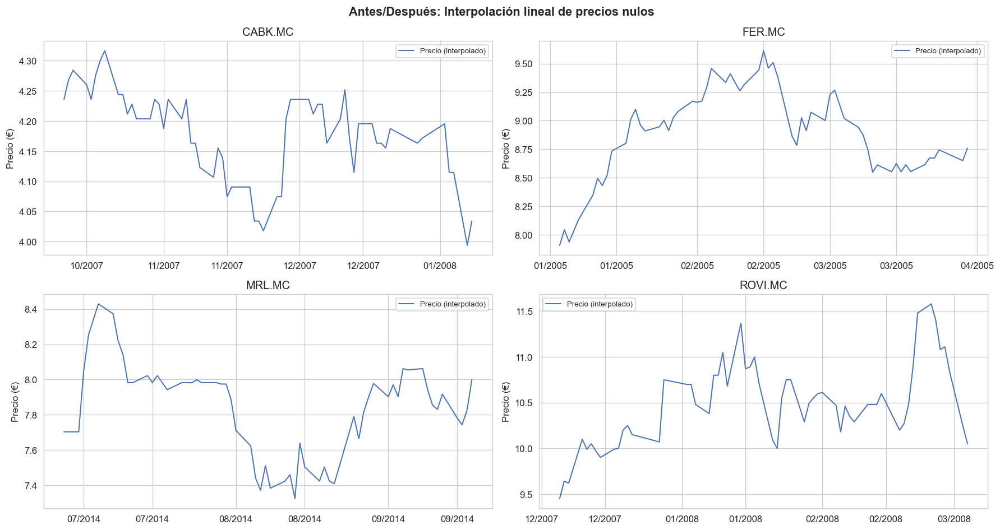
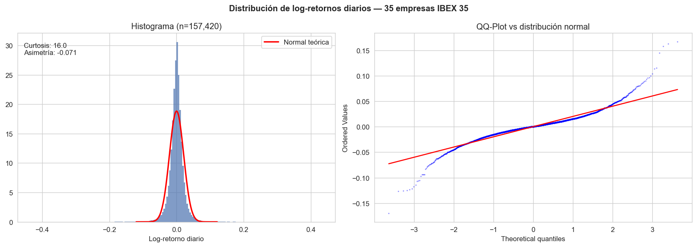
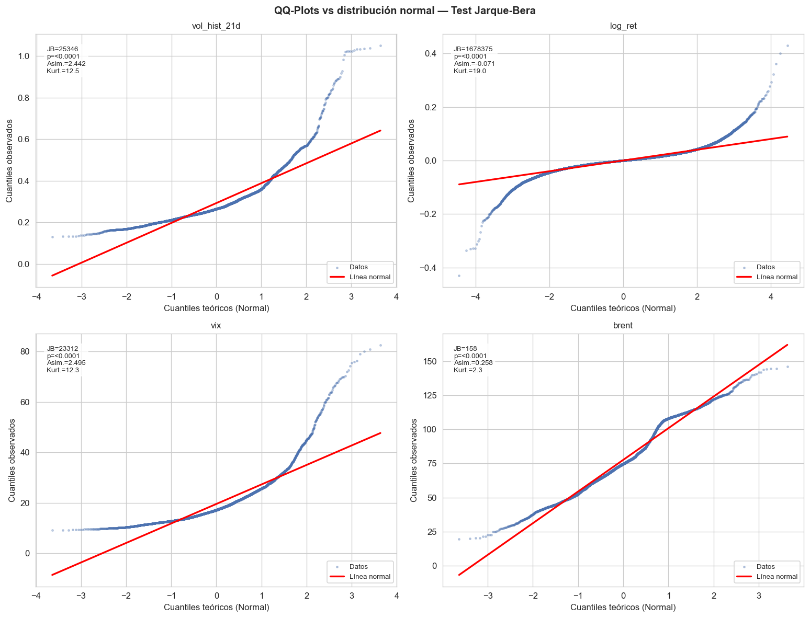
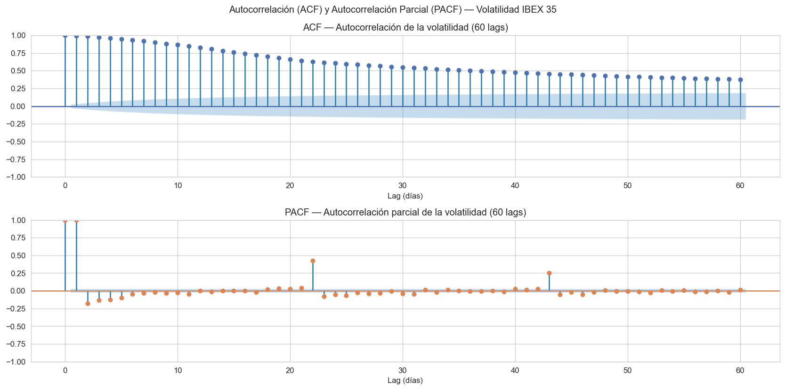
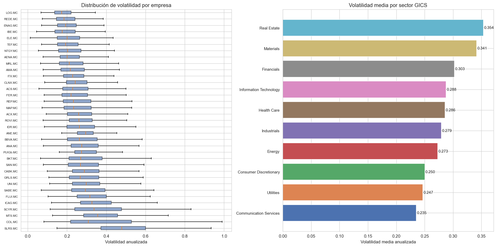
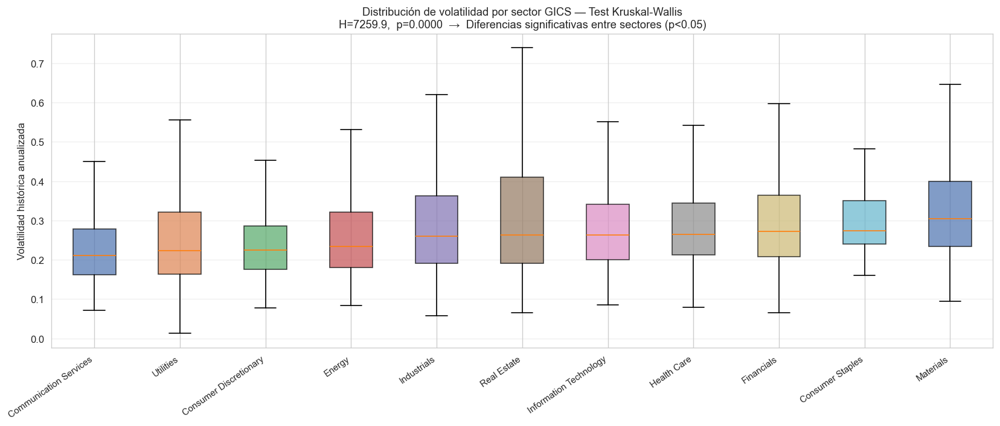
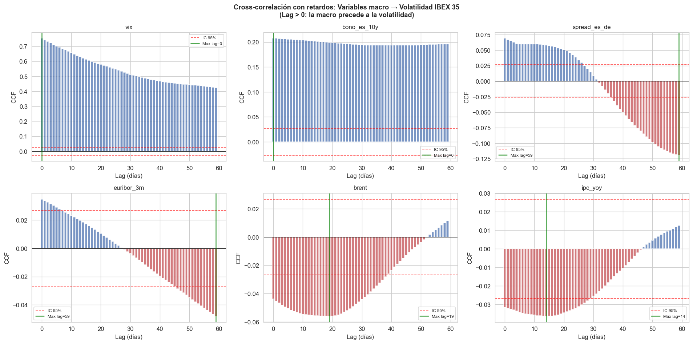
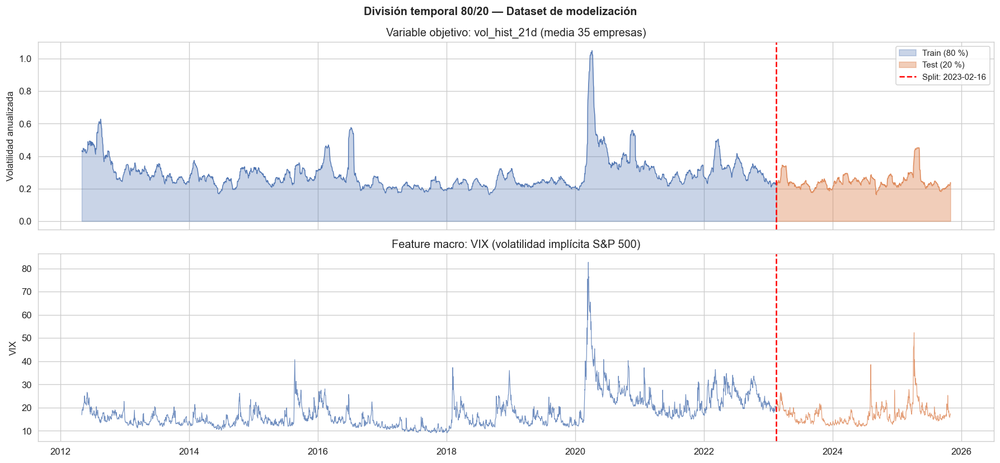

# Ingeniería del Dato

## 1. Introducción

La fase de Ingeniería del Dato constituye el pilar fundamental sobre el que se construye todo el análisis posterior de este trabajo. Su objetivo es construir un dataset maestro que integre, en una única tabla de frecuencia diaria, los precios de las 35 empresas del IBEX 35 junto con **21 variables macroeconómicas** de distinta naturaleza y frecuencia temporal. Este proceso abarca la extracción de datos desde múltiples fuentes heterogéneas, su transformación y limpieza, la alineación temporal al calendario bursátil español y un análisis exploratorio exhaustivo que justifica las decisiones de diseño adoptadas para la fase de modelización.

El pipeline completo se implementa en **cuatro notebooks secuenciales** de Python (`01_ETL_empresas`, `02_ETL_macro`, `03_validacion`, `04_EDA`) y culmina en una base de datos SQLite (`tfg.db`) con 8 tablas y más de 325.000 registros.

## 2. Herramientas tecnológicas

El entorno de desarrollo utilizado es **Python 3** ejecutado sobre **Jupyter Notebook**, lo que permite combinar código, visualizaciones y documentación en un flujo de trabajo reproducible. Las principales librerías empleadas son:

- **pandas** y **NumPy**: manipulación de DataFrames, cálculos vectorizados, gestión de fechas y operaciones de ventana móvil.
- **SQLAlchemy** y **sqlite3**: conexión y escritura en la base de datos relacional SQLite, elegida por su ligereza y portabilidad (no requiere servidor).
- **matplotlib** y **seaborn**: visualización estadística con configuración personalizada (DPI 120, estilo `whitegrid`, paleta `deep`).
- **scipy.stats**: tests de normalidad (Jarque-Bera), detección de outliers (Z-score), tests no paramétricos (Mann-Whitney U, Kruskal-Wallis).
- **statsmodels**: test de estacionariedad Augmented Dickey-Fuller (ADF), funciones de autocorrelación (ACF/PACF) y cross-correlación (CCF).

La base de datos SQLite fue elegida frente a alternativas como PostgreSQL o CSV planos porque ofrece un equilibrio óptimo entre rendimiento, portabilidad y facilidad de consulta SQL, sin requerir la instalación ni administración de un servidor externo.

## 3. Origen de los datos

Los datos de este trabajo provienen de **siete fuentes distintas**, lo que refleja la naturaleza heterogénea de la información financiera y macroeconómica. Cada fuente presenta formatos, frecuencias y convenciones diferentes, lo que exige un proceso de extracción específico para cada una.

### 3.1. Reuters Eikon — Precios de empresas

La fuente principal de datos bursátiles es la plataforma **Reuters Eikon** (Refinitiv), terminal profesional de información financiera. Se extrajeron dos tipos de datos:

- **Fichero de referencia** (`GridExport_November_5_2025_21_27_3.xlsx`): listado de las 35 empresas del IBEX 35, incluyendo su RIC (Reuters Instrument Code), nombre completo, ticker de mercado, sector GICS (Global Industry Classification Standard) e ISIN.
- **35 archivos de precios históricos** (uno por empresa, formato `.xlsx`): datos diarios OHLCV (Open, High, Low, Close, Volume) desde enero de 2005 hasta octubre de 2025.

Los archivos de Reuters Eikon presentan una particularidad técnica: incluyen metadatos y cabeceras institucionales en las primeras ~30 filas del archivo Excel, antes de que comiencen los datos reales. Esto requiere una detección automática de la fila de cabecera, que se resuelve buscando la cadena `"Exchange Date"` en cada fila del archivo.

### 3.2. Reuters Eikon — Variables macroeconómicas

De Reuters Eikon también se obtienen series macroeconómicas de frecuencia mensual y trimestral (PIB, IPC, EUR/USD, Gas TTF, entre otras). Estos archivos utilizan un formato de hoja de cálculo con los datos en la pestaña `"First Release Data"`, donde los períodos se expresan como cadenas de texto (`"Q1 2005"` para trimestrales, `"Jan 2005"` para mensuales) que requieren un parsing específico.

### 3.3. Investing.com

Del portal financiero **Investing.com** se descargan series diarias en formato CSV con convención numérica europea (punto como separador de miles, coma como separador decimal): bonos soberanos, índices de volatilidad implícita (VIX, VIBEX, VSTOXX) y commodities (Brent). La lectura requiere una función de parsing que elimine símbolos de porcentaje, reemplace separadores de miles y convierta la coma decimal al punto anglosajón.

### 3.4. Instituto Nacional de Estadística (INE)

Del INE se obtienen el Índice de Producción Industrial (`ipi_yoy`) y el IPC subyacente mensual (`ipc_sub_mom`) en un formato peculiar de **matriz año × mes**, donde las filas representan años y las columnas los meses (`M01` a `M12`). Este formato requiere una transformación de ancho a largo (*unpivot/melt*), asignando a cada valor su fecha correspondiente como el primer día del mes.

### 3.5. Banco Central Europeo (BCE)

Se obtienen dos tipos de datos del BCE: los **Euribor 3M y 6M** desde el ECB Data Portal en formato `.xlsx` (frecuencia mensual, 250 observaciones cada uno) y los **tipos de interés oficiales** (`tipo_dfr`, `tipo_mlf`, `tipo_mro`) desde epdata.es en formato CSV con separador `;`, decimal `,` y nombres de mes en español.

### 3.6. Resumen de fuentes

En total, el proyecto combina **7 fuentes**, **4 formatos de archivo** distintos y **4 frecuencias temporales** (diaria, mensual, trimestral, irregular).

| Fuente | Variables | Formato | Frecuencia |
|---|---|---|---|
| Reuters Eikon (precios) | 35 empresas × OHLCV | Excel con metadatos | Diaria |
| Reuters Eikon (macro) | PIB, IPC, EUR/USD, Gas TTF | Excel con metadatos | Diaria/Mensual/Trimestral |
| Investing.com | Bonos, VIX, VIBEX, VSTOXX, Brent | CSV europeo | Diaria |
| INE | IPI, IPC subyacente | Excel matriz año×mes | Mensual |
| BCE (ECB Data Portal) | Euribor 3M, 6M | Excel estándar | Mensual |
| BCE (epdata.es) | Tipos DFR, MLF, MRO | CSV separador `;` | Irregular |

## 4. Extracción y transformación de datos

### 4.1. ETL de precios de empresas

Para cada uno de los 35 archivos de precios se implementa la función `leer_empresa(filepath, ticker)`, que sigue cuatro pasos clave: (1) **detección automática de cabecera** mediante búsqueda iterativa de la cadena `"Exchange Date"`, lo que resuelve el problema de los metadatos variables de Reuters Eikon; (2) **estandarización de nombres de columnas** y conversión de tipos numéricos; (3) **parseo y filtrado temporal** desde 2005-01-01 con `pd.to_datetime(errors='coerce')`; (4) **adición del ticker** como columna identificadora. Los 35 archivos se procesan en bucle y se concatenan en un único DataFrame de **157.455 filas × 9 columnas**, que cubre el período del 3 de enero de 2005 al 31 de octubre de 2025.

#### 4.1.1. Heterogeneidad en la cobertura temporal

No todas las empresas cotizan durante los 20 años completos del estudio. La mayoría dispone de la serie histórica completa (5.323 días de trading desde 2005), pero otras se incorporaron al IBEX en fechas posteriores. Los casos más extremos son:

- **Puig Brands** (`PUIGb.MC`): salida a bolsa el 3 de mayo de 2024, con solo 385 observaciones.
- **Antevenio** (`ANE.MC`): 1.112 observaciones desde julio de 2021.
- **Unicaja** (`UNI.MC`): 2.134 observaciones desde junio de 2017.

Esta heterogeneidad no se corrige (no se eliminan empresas con menos datos), ya que el formato panel del dataset maestro permite analizar cada empresa en su rango temporal real.

#### 4.1.2. Variables derivadas

Sobre los datos brutos de precios se calculan dos variables fundamentales para el análisis:

**Log-retorno diario** (`log_ret`):

$$r_t = \ln\left(\frac{P_t}{P_{t-1}}\right)$$

donde $P_t$ es el precio de cierre en el día $t$. El log-retorno se prefiere sobre el retorno aritmético simple porque (1) es **aditivo en el tiempo**, (2) aproxima bien el retorno aritmético para variaciones pequeñas, y (3) presenta mejores propiedades estadísticas.

**Volatilidad histórica anualizada** (`vol_hist_21d`):

$$\sigma_{t,21} = \sqrt{252} \cdot \text{std}(r_{t-20}, r_{t-19}, \ldots, r_t)$$

Corresponde a la desviación típica de los log-retornos en una ventana móvil de 21 días de trading (~1 mes), multiplicada por $\sqrt{252}$ para anualizar la estimación. Se utiliza `min_periods=10` para que las empresas con series cortas no pierdan las primeras 20 observaciones. Esta variable es el **objetivo principal** (*target*) de los modelos de predicción del capítulo de Análisis del Dato.

{width=90%}

### 4.2. ETL de variables macroeconómicas

La heterogeneidad de formatos requiere **cuatro funciones de parsing especializadas**, una por tipo de fuente: `parsear_numero_europeo()` (formato europeo de Investing.com), `leer_investing_csv()` (CSV con fechas `dd.mm.yyyy`), `leer_reuters_macro()` (Excel con períodos `"Q1 2005"` o `"Jan 2005"`) y `leer_ine_matriz()` (matriz año × mes con `melt`).

#### 4.2.1. Organización en bloques temáticos

Las **21 variables macroeconómicas** se organizan en cuatro bloques temáticos, cada uno reflejando un canal de transmisión distinto hacia la volatilidad bursátil:

- **Bloque 1 — Actividad económica**: PIB interanual, tasa de paro, IPI y PMI. Capturan el canal real de la economía: en recesiones, la incertidumbre sobre los beneficios empresariales eleva la volatilidad.
- **Bloque 2 — Condiciones monetarias y financieras**: bonos soberanos (España y Alemania 10Y), spread, EUR/USD, Euribor 3M y 6M, tipos oficiales del BCE (DFR, MLF, MRO) e IPC interanual. Capturan el canal monetario.
- **Bloque 3 — Precios e inflación**: IPC subyacente mensual, que mide presiones inflacionarias de fondo excluyendo energía y alimentos no elaborados.
- **Bloque 4 — Riesgo global, commodities y divisas**: VIX, VIBEX, VSTOXX, Brent y Gas Natural TTF. Reflejan el canal de contagio entre mercados globales.

#### 4.2.2. Carga en base de datos

Las variables se agrupan en **5 tablas SQLite** según su frecuencia y temática:

| Tabla | Frecuencia | Variables principales | Filas |
|---|---|---|---|
| `macro_act_mensual` | Mensual | `ipi_yoy`, `pmi`, `ipc_sub_mom` | 250 |
| `macro_act_trimes` | Trimestral | `pib_yoy`, `tasa_paro` | 82 |
| `macro_mon_diario` | Diaria | `bono_es_10y`, `bono_de_10y`, `spread_es_de`, `eur_usd` | 5.865 |
| `macro_mon_mensual` | Mensual | `euribor_3m`, `euribor_6m`, `tipo_dfr`, `tipo_mlf`, `tipo_mro`, `ipc_yoy` | 423 |
| `macro_riesgo` | Diaria | `vix`, `vibex`, `vstoxx`, `brent`, `gas_ttf` | 5.091 |

Las tablas dentro de cada bloque se construyen mediante `merge(on='fecha', how='outer')` para preservar todas las fechas disponibles, aunque provengan de series con rangos temporales distintos.

## 5. Limpieza y alineación temporal

### 5.1. Tratamiento de nulos en precios

El control de calidad del dataset de precios revela **8 valores nulos** en la columna `close`, distribuidos en 4 empresas (CABK, FER, MRL, ROVI). Estos nulos corresponden a días en los que la plataforma Reuters no registró precio de cierre, probablemente por suspensiones temporales de cotización o errores en la exportación.

**Decisión: interpolación lineal.** Se opta por `pandas.interpolate(method='linear', limit_direction='both')`, aplicada por empresa. Este método estima el precio faltante como el punto medio ponderado entre el último precio conocido y el siguiente disponible. Se prefiere sobre las alternativas porque:

- **Frente a forward-fill (`ffill`)**: los precios tienen tendencia, por lo que arrastrar el último valor conocido introduce un sesgo sistemático.
- **Frente a eliminación de filas**: penalizaría a las otras 34 empresas que sí tienen dato ese día.
- **Frente a la media**: el precio medio histórico no tiene sentido para una serie con tendencia temporal.

Tras la imputación se recalculan `log_ret` y `vol_hist_21d`. **Verificación final**: 0 nulos en `close`, 0 duplicados por par `(ticker, fecha)`, 0 precios negativos o cero.

{width=90%}

### 5.2. Nulos estructurales en datos macroeconómicos

En las variables macroeconómicas, los nulos no son errores sino **ausencias estructurales** derivadas de (1) **distintos rangos temporales** (el VIBEX comienza en 2015, el spread España-Alemania en 2014, los tipos BCE en 2009) y (2) **distinta frecuencia de publicación** (el PIB solo se publica una vez al trimestre). Estas ausencias se resuelven en la alineación temporal mediante forward-fill (sección 5.4), que es la aproximación correcta desde el punto de vista de la información disponible para un inversor.

> **Nota metodológica**: existen dos tipos de nulos en este proyecto, tratados de forma distinta. Los nulos en precios se imputan con **interpolación lineal** (porque son días puntuales con dato faltante entre dos puntos válidos). Los nulos en macro se rellenan con **forward-fill** (porque reflejan que el dato anterior sigue vigente hasta la próxima publicación oficial). Confundir ambos métodos introduciría sesgos opuestos.

### 5.3. El problema de las frecuencias múltiples

El principal reto técnico de este capítulo es la integración de datos con frecuencias muy distintas en un único dataset diario: precios y variables financieras (5.323 fechas), variables mensuales (IPI, IPC, Euribor, ~12 obs/año), trimestrales (PIB, tasa de paro, ~4 obs/año) e irregulares (tipos BCE, solo cuando hay decisión de política monetaria). No es posible simplemente hacer un `merge` por fecha, porque las fechas de las variables mensuales (primer día del mes) o trimestrales (primer día del trimestre) rara vez coinciden con días de negociación bursátil.

### 5.4. Solución: forward-fill y `merge_asof`

La estrategia adoptada sigue el enfoque estándar de la econometría financiera:

1. **Construcción del calendario bursátil**: se extraen las **5.323 fechas de negociación únicas** de la tabla `precios_empresas`.
2. **Forward-fill interno** (`ffill()`) en cada tabla macro: propaga el último valor publicado hasta la siguiente publicación, reflejando que un dato macroeconómico mantiene su vigencia hasta el siguiente release oficial.
3. **Alineación con `pd.merge_asof(direction='backward')`**: para cada fecha del calendario bursátil se asigna el último valor macro disponible **antes o en** esa fecha. Esto es conceptualmente correcto porque un inversor que opera el día $t$ solo puede conocer la información publicada hasta ese momento, evitando *data leakage*.
4. **Combinación** de las 5 tablas macro alineadas en una única tabla `df_macro_diario` de 5.323 filas × 21 columnas.
5. **Merge final** con precios para que cada empresa en cada día reciba sus variables macro correspondientes.

**Resultado**: el **dataset maestro** contiene **157.455 filas × 31 columnas**, formando un panel desbalanceado donde cada empresa cubre su rango histórico real sobre el calendario bursátil común de 5.323 días.

### 5.5. Cobertura del dataset maestro

El análisis de nulos del dataset maestro revela tres niveles de cobertura: variables con cobertura prácticamente completa (`vix`, `euribor_3m`, `pib_yoy`, `bono_es_10y`, `brent` con >89%), variables con cobertura parcial limitada por su histórico de publicación (`ipc_yoy` 70,9%, `vstoxx` 67,9%, `spread_es_de` 52,6%) y variables con cobertura insuficiente (`vibex` 39,1% desde 2015 y `pmi` con apenas **16,8%** al estar disponible solo desde 2023).

| Variable | Cobertura | Período efectivo |
|---|---|---|
| `euribor_3m` | 99,8% | 2005-2025 |
| `pib_yoy` | 99,2% | 2005-2025 |
| `vix` | 96,2% | 2005-2025 |
| `brent` | 95,1% | 2005-2025 |
| `bono_es_10y` | 89,7% | 2005-2025 |
| `ipc_yoy` | 70,9% | 2008-2025 |
| `spread_es_de` | 52,6% | 2014-2025 |
| `vibex` | 39,1% | 2015-2025 |
| `pmi` | 16,8% | 2023-2025 |

{width=90%}

## 6. Análisis exploratorio de datos (EDA)

El análisis exploratorio se estructura en bloques que progresan desde los estadísticos descriptivos hasta los tests formales de hipótesis, documentando cada hallazgo y su implicación para la modelización.

### 6.1. Estadísticos descriptivos

Los **log-retornos** del panel completo (157.420 observaciones) presentan media casi nula (0,00015), desviación típica de 0,0212, asimetría ligeramente negativa (-0,071) y una **curtosis (exceso) de 19,00**, frente al valor de 3 de una distribución normal. Esta curtosis extremadamente elevada indica colas muy pesadas: los eventos extremos (caídas o subidas superiores al 10% en un día) son mucho más frecuentes de lo que predeciría una distribución gaussiana. Este hallazgo, conocido como *fat tails* (Mandelbrot, 1963), implica que los modelos que asuman normalidad subestimarán sistemáticamente el riesgo de cola.

A nivel individual, **20 de las 35 empresas presentan asimetría negativa** y 15 positiva, lo que confirma la prevalencia de la asimetría de retornos en mercados desarrollados (las caídas tienden a ser más bruscas que las subidas).

La **volatilidad histórica** del IBEX 35 tiene media de 0,2926 (29,26% anualizada), con una distribución marcadamente asimétrica a la derecha (asimetría = 2,44, curtosis = 12,53), reflejando que los períodos de alta volatilidad son más extremos y más persistentes que los de baja volatilidad. La *Figura 4* muestra la evolución temporal de esta volatilidad media a lo largo del período 2005–2025, donde se aprecian claramente los episodios de crisis financiera que definen la estructura de la serie.

{width=95%}

### 6.2. Tests de estacionariedad (ADF)

La estacionariedad es un requisito fundamental para la mayoría de los modelos econométricos. Se aplica el test **Augmented Dickey-Fuller** (ADF) con selección automática de retardos por criterio AIC. La hipótesis nula es que la serie tiene raíz unitaria (no es estacionaria); se rechaza con $p < 0{,}05$.

| Variable | ADF | p-valor | ¿Estacionaria? |
|---|---|---|---|
| Precio de cierre (SAN.MC) | -1,73 | 0,4166 | **NO** |
| Log-retorno (SAN.MC) | -43,24 | <0,0001 | **SÍ** |
| Volatilidad hist. 21d (SAN.MC) | -6,17 | <0,0001 | **SÍ** |
| VIX | -5,60 | <0,0001 | **SÍ** |
| Bono ES 10Y | -1,36 | 0,6005 | **NO** |
| Euribor 3M | -1,91 | 0,3255 | **NO** |
| IPC YoY | -1,72 | 0,4230 | **NO** |
| PIB YoY | -4,48 | 0,0002 | **SÍ** |

**Implicaciones para la modelización:** los precios no se utilizan como features (justifica la transformación a log-retornos). Los log-retornos y la volatilidad sí son estacionarios, validando su uso como input y target. Las variables macro no estacionarias (bono, euribor, IPC) se usan con precaución: el forward-fill las trata como niveles constantes entre publicaciones, lo cual es coherente con su papel de "información disponible".

### 6.3. Distribución de retornos y test de normalidad (Jarque-Bera)

El test de **Jarque-Bera** evalúa la normalidad de una serie midiendo simultáneamente su asimetría y su curtosis. Los resultados son contundentes:

| Variable | JB | p-valor | ¿Normal? | Curtosis |
|---|---|---|---|---|
| `log_ret` | 1.678.375 | <0,0001 | **NO** | 19,00 |
| `vol_hist_21d` | 25.346 | <0,0001 | **NO** | 12,53 |
| `vix` | 23.312 | <0,0001 | **NO** | 12,31 |
| `bono_es_10y` | 199 | <0,0001 | **NO** | 2,04 |
| `euribor_3m` | 638 | <0,0001 | **NO** | 2,25 |
| `brent` | 158 | <0,0001 | **NO** | 2,29 |

**Ninguna variable financiera sigue una distribución normal**. El rechazo es universal y con estadísticos de magnitud enorme (1,67 millones para los log-retornos). Esta evidencia justifica dos decisiones de diseño:

1. Utilizar la distribución **t-Student** (en lugar de normal) para las innovaciones del modelo GARCH (Bollerslev, 1986), capaz de modelar colas pesadas.
2. Interpretar los intervalos de confianza del modelo OLS con cautela, aunque la estimación puntual por MCO sigue siendo consistente por el teorema de Gauss-Markov (que no requiere normalidad).

La *Figura 5* ilustra la distribución de los log-retornos frente a la normal teórica, y la *Figura 6* muestra los QQ-plots que confirman visualmente la desviación en las colas.

{width=90%}

{width=90%}

### 6.4. Memoria larga de la volatilidad (ACF/PACF)

Las funciones ACF y PACF de la volatilidad media del IBEX 35 (60 retardos) revelan una **persistencia extraordinaria**: los coeficientes de la ACF son significativamente positivos en todos los lags hasta 60. La PACF muestra picos en los lags 1, 5 y 21, correspondientes a las escalas diaria, semanal y mensual.

> **Nota metodológica**: la ventana de 21 días utilizada para calcular la volatilidad introduce una autocorrelación mecánica en los primeros 20 lags (observaciones sucesivas comparten datos). La persistencia genuina se observa en lags > 21, donde la ACF sigue siendo significativa.

Esta memoria larga justifica el uso del modelo **HAR** (Heterogeneous Autoregressive, Corsi 2009), que incorpora retardos a tres escalas (1, 5 y 21 días), y del modelo **GARCH** (Bollerslev, 1986), que captura la persistencia autorregresiva de la varianza condicional.

{width=90%}

### 6.5. Detección y tratamiento de outliers

Se aplican dos métodos complementarios. El **IQR** marca como outlier cualquier valor fuera de $[Q_1 - 1{,}5 \cdot IQR,\ Q_3 + 1{,}5 \cdot IQR]$ y es un método robusto que no asume distribución. El **Z-score** considera outlier cualquier $|z| > 3$ y es un método paramétrico que asume normalidad. Ambos se complementan: el IQR captura asimetrías extremas, el Z-score capta magnitudes muy alejadas de la media.

| Variable | Outliers IQR | % | Outliers \|z\|>3 | % |
|---|---|---|---|---|
| `vol_hist_21d` | 8.169 | 5,20% | 2.801 | 1,78% |
| `log_ret` | 9.500 | 6,03% | 2.446 | 1,55% |
| `vix` | 6.774 | 4,47% | 3.157 | 2,08% |
| `bono_es_10y` | 0 | 0,00% | 0 | 0,00% |

**Decisión: mantener todos los outliers.** Los valores extremos de volatilidad y retornos corresponden a períodos de crisis financiera real (2008, 2010, 2020, 2022) y constituyen **señal económica**, no errores de medición. Eliminarlos supondría descartar precisamente los episodios que el modelo debe aprender a capturar. Además, el modelo GARCH con distribución t-Student es robusto a valores extremos por diseño.

{width=90%}

### 6.6. Volatilidad por empresa y sector — Test de Kruskal-Wallis

El análisis descriptivo de la volatilidad a nivel de empresa y sector evidencia una notable heterogeneidad: Real Estate y Materials concentran los valores más altos, mientras que Communication Services y Consumer Discretionary muestran los perfiles más estables.

{width=90%}

Dado que la distribución de la volatilidad no es normal (Jarque-Bera), se utiliza el test no paramétrico de **Kruskal-Wallis** para evaluar si existen diferencias significativas entre los 11 sectores GICS:

$$H = 7.259{,}89 \quad (p \approx 0)$$

Se rechaza la hipótesis nula de igualdad de distribuciones. El análisis post-hoc con **Mann-Whitney U** y corrección de **Bonferroni** ($\alpha = 0{,}0009$ para 55 comparaciones por pares) identifica **47 de 55 pares** de sectores con diferencias estadísticamente significativas. Los sectores más volátiles son **Real Estate (35,4%)**, **Materials (34,2%)** y **Financials (30,7%)**, mientras que los menos volátiles son **Communication Services (23,5%)** y **Consumer Discretionary (24,9%)**. Este resultado confirma que la pertenencia sectorial es una variable relevante que explica diferencias sistemáticas de volatilidad.

{width=90%}

### 6.7. Relación con las variables macro: correlaciones y cross-correlación

El punto de partida del análisis de relaciones es la evolución temporal de las propias variables macro, que permite identificar los regímenes económicos relevantes del período de estudio.

{width=95%}

Las correlaciones de Pearson entre cada variable macro y la volatilidad media del IBEX 35 revelan una jerarquía clara de drivers:

**Correlaciones positivas más fuertes** (riesgo): VIBEX (+0,824), VIX (+0,754), VSTOXX (+0,728), Bono ES 10Y (+0,208), tasa de paro (+0,178).

**Correlaciones negativas más fuertes** (actividad real): IPI YoY (−0,442), PIB YoY (−0,429).

Estas correlaciones confirman la intuición económica: los indicadores de riesgo se asocian positivamente con la volatilidad, mientras que los indicadores de actividad real se asocian negativamente. El heatmap triangular entre las propias variables macro revela multicolinealidades importantes que se deben tener en cuenta en la modelización (VIX-VSTOXX: +0,93; `euribor_3m`-`euribor_6m`: +0,99).

{width=95%}

La comparación directa de la volatilidad del IBEX con las dos variables macro más representativas (VIX como indicador de riesgo global y Euribor 3M como condición monetaria) ilustra visualmente estas relaciones y los cambios de régimen observados entre 2008 y 2023.

{width=90%}

El análisis de **cross-correlación** (CCF) con retardos de 0 a 60 días permite evaluar si alguna variable macro **lidera** la volatilidad. La banda de confianza al 95% es ±0,0269 ($1{,}96 / \sqrt{5{.}323}$):

| Variable | CCF máxima | Lag óptimo | Interpretación |
|---|---|---|---|
| VIX | +0,754 | 0 | Relación contemporánea |
| Bono ES 10Y | +0,208 | 0 | Relación contemporánea |
| Spread ES-DE | −0,119 | 59 | Adelanta la volatilidad |
| Brent | −0,056 | 19 | Efecto retardado |
| Euribor 3M | −0,048 | 59 | Efecto retardado |
| IPC YoY | −0,036 | 14 | Efecto retardado |

El VIX y el bono español presentan su máxima correlación en lag 0 (contemporánea), mientras que el spread, el euribor y el brent presentan correlaciones máximas en lags positivos, sugiriendo que estos indicadores podrían **liderar** la volatilidad del IBEX con varios días o semanas de antelación. Este hallazgo abre la puerta a un Event Study en la fase de Análisis del Dato.

{width=90%}

### 6.8. Split temporal train/test

Para la fase de modelización se adopta un **split fijo por fecha** (no aleatorio), respetando la estructura temporal de los datos. Las observaciones más recientes conforman el conjunto de test, simulando una predicción fuera de muestra. Esta decisión evita el *data leakage* que se produciría si observaciones futuras aparecieran en el conjunto de entrenamiento.

{width=90%}

## 7. Decisiones finales y conclusión

El EDA culmina con una tabla de decisión que consolida los hallazgos y determina qué variables pasan a la fase de modelización:

| Decisión | Variables | Justificación |
|---|---|---|
| **MANTENER** | `vol_hist_21d` (target), `log_ret`, `vix`, `vibex`, `vstoxx`, `bono_es_10y`, `bono_de_10y`, `spread_es_de`, `eur_usd`, `euribor_3m`, `euribor_6m`, `tipo_dfr`, `ipc_yoy`, `ipc_sub_mom`, `pib_yoy`, `tasa_paro`, `ipi_yoy`, `brent`, `gas_ttf` | Cobertura suficiente, relevancia económica y correlación significativa con la volatilidad |
| **REDUNDANTE** | `tipo_mlf`, `tipo_mro` | Colinealidad perfecta con `tipo_dfr`: el BCE anuncia los tres tipos simultáneamente, por lo que incluirlos los tres introduce multicolinealidad exacta sin aportar información adicional |
| **USO LIMITADO** | `pmi` | Solo cobertura desde 2023 (16,8% del período total). Insuficiente para usarse como predictor en modelos que cubren 20 años |

**Resumen del capítulo.** A partir de **7 fuentes heterogéneas** se ha construido un dataset maestro consolidado de **157.455 filas × 31 columnas** que integra los precios diarios de las 35 empresas del IBEX 35 con 21 variables macroeconómicas, sobre un calendario bursátil común de 5.323 días (2005–2025). El proceso ha incluido la detección automática de cabeceras Reuters, parsing especializado por formato (Investing, INE, BCE), interpolación lineal de 8 nulos puntuales en precios, alineación temporal mediante forward-fill + `merge_asof` para evitar *data leakage*, y un EDA exhaustivo que ha validado las propiedades estadísticas necesarias para la modelización (estacionariedad de retornos y volatilidad, no normalidad, memoria larga y heterogeneidad sectorial).

La variable objetivo del siguiente capítulo será **`vol_hist_21d`**, modelizada con cuatro aproximaciones progresivas: un modelo Simple de referencia, un OLS con estructura HAR (Corsi, 2009) extendido con macro, un GARCH(1,1) con innovaciones t-Student (Bollerslev, 1986) y un XGBoost no lineal. Las decisiones tomadas en este capítulo (transformaciones, exclusión de variables redundantes, split temporal, justificación de outliers) condicionan directamente las elecciones metodológicas de la fase de Análisis del Dato.

## 8. Base de datos final

El resultado del proceso completo de ingeniería del dato es una base de datos SQLite (`tfg.db`) con **8 tablas** y más de **325.000 registros**:

| Tabla | Filas | Cols | Descripción |
|---|---|---|---|
| `precios_empresas` | 157.455 | 11 | Precios OHLCV + retornos + volatilidad |
| `ref_empresas` | 36 | 5 | Catálogo de empresas IBEX 35 |
| `macro_act_mensual` | 250 | 4 | Actividad económica mensual |
| `macro_act_trimes` | 82 | 3 | Actividad económica trimestral |
| `macro_mon_diario` | 5.865 | 5 | Condiciones monetarias diarias |
| `macro_mon_mensual` | 423 | 7 | Condiciones monetarias mensuales |
| `macro_riesgo` | 5.091 | 6 | Riesgo global y commodities |
| `dataset_maestro` | 157.455 | 31 | Dataset consolidado para modelización |

El diseño en estrella, con las tablas de origen separadas del dataset maestro consolidado, permite tanto la **trazabilidad completa del dato** (se puede verificar cualquier valor volviendo a la tabla de origen) como la **eficiencia en la fase de modelización** (una sola tabla contiene toda la información necesaria). Adicionalmente, se generan copias de seguridad en formato CSV y Parquet en `data/processed/`, garantizando la portabilidad fuera del ecosistema SQLite.
